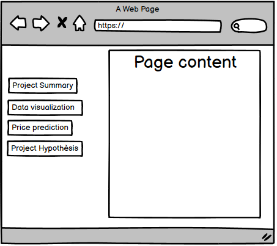

# House Pricing Prediction

House Pricing Prediction is Project 5 of predict analytic to help the user to predict of the price of the house, 

The project has been deployed on Heroku in this [link](https://house-prediction-project-ef397f4fe1e6.herokuapp.com/)

## Table of contents

1. [Origin dataset](#1-origin-dataset)

2. [Business requirements](#2-business-requirements)

    + [Epics](#epics)

    + [UserStories](#user-stories)

3. [Hypothesis and how to validate](#3-hypothesis-and-how-to-validate)

4. [The rationale to map the business requirements](#4-the-rationale-to-map-the-business-requirements)

5. [ML Business case](#5-ml-business-case)

6. [Dashboard intended design](#6-dashboard-design)

7. [Unfixed](#7-unfixed-bugs)

8. [Deployment](#8-deployment)

9. [Main data analytics and Machine learning libraries](#9-Main-data-analytics-and-Machine-learning-libraries)

## **1. Origin Dataset**

+ The dataset for this project is sourced from [Kaggle](https://www.kaggle.com/codeinstitute/housing-prices-data). 
+ User stories are created to give expectation about users
+ Table below showcasing the variable, the description, 

|Variable|Meaning|Units|
|:----|:----|:----|
|1stFlrSF|First Floor square feet|334 - 4692|
|2ndFlrSF|Second floor square feet|0 - 2065|
|BedroomAbvGr|Bedrooms above grade (does NOT include basement bedrooms)|0 - 8|
|BsmtExposure|Refers to walkout or garden level walls|Gd: Good Exposure; Av: Average Exposure; Mn: Mimimum Exposure; No: No Exposure; None: No Basement|
|BsmtFinType1|Rating of basement finished area|GLQ: Good Living Quarters; ALQ: Average Living Quarters; BLQ: Below Average Living Quarters; Rec: Average Rec Room; LwQ: Low Quality; Unf: Unfinshed; None: No Basement|
|BsmtFinSF1|Type 1 finished square feet|0 - 5644|
|BsmtUnfSF|Unfinished square feet of basement area|0 - 2336|
|TotalBsmtSF|Total square feet of basement area|0 - 6110|
|GarageArea|Size of garage in square feet|0 - 1418|
|GarageFinish|Interior finish of the garage|Fin: Finished; RFn: Rough Finished; Unf: Unfinished; None: No Garage|
|GarageYrBlt|Year garage was built|1900 - 2010|
|GrLivArea|Above grade (ground) living area square feet|334 - 5642|
|KitchenQual|Kitchen quality|Ex: Excellent; Gd: Good; TA: Typical/Average; Fa: Fair; Po: Poor|
|LotArea| Lot size in square feet|1300 - 215245|
|LotFrontage| Linear feet of street connected to property|21 - 313|
|MasVnrArea|Masonry veneer area in square feet|0 - 1600|
|EnclosedPorch|Enclosed porch area in square feet|0 - 286|
|OpenPorchSF|Open porch area in square feet|0 - 547|
|OverallCond|Rates the overall condition of the house|10: Very Excellent; 9: Excellent; 8: Very Good; 7: Good; 6: Above Average; 5: Average; 4: Below Average; 3: Fair; 2: Poor; 1: Very Poor|
|OverallQual|Rates the overall material and finish of the house|10: Very Excellent; 9: Excellent; 8: Very Good; 7: Good; 6: Above Average; 5: Average; 4: Below Average; 3: Fair; 2: Poor; 1: Very Poor|
|WoodDeckSF|Wood deck area in square feet|0 - 736|
|YearBuilt|Original construction date|1872 - 2010|
|YearRemodAdd|Remodel date (same as construction date if no remodeling or additions)|1950 - 2010|
|SalePrice|Sale Price|34900 - 755000|

## **2. Business Requirements**

1 - The client is interested in discovering how the house attributes correlate with the sale price. Therefore, the client expects data visualisations of the correlated variables against the sale price to show that.
2 - The client is interested in predicting the house sale price from her four inherited houses and any other house in Ames, Iowa.

### Epics

+ Data collecting

+ Data cleaning, train and testing machine learning models

+ Data corralation for bulding accurate models

+ Modeling the data using machine learning method, such as Random forest and Gradient boosting

### User stories

+ As client, I want to be know what features that are corralate with SalePrices, from the most to the least corralated.(Data_Correlation.ipynb)

+ As technical user, I want to know which models performing better and which one performing worst. (Modeling.ipynb)

+ As techincal user, I want to know the process of the ML model. (Modeling.ipynb)

+ As client, I want to have a clean datasets that are easy to understand. (Data_Cleaning.ipynb)

+ As user, I want to know the source of the data.

+ As client, I want to see the dashboard where the data can be process.

+ As user, I want to see graphs that are simplfied (Data_Cleaning.ipynb)

+ As client, 

+ As user, I want to have access to both unclean and clean data (Data_Cleaning.ipynb)

+ As user, I want to know the summrize of the project.

## **3. Hypothesis and how to validate**

+ Based on the correlation that it can be speculated that the most important features are OverallQual, YearBuilt, and YearRemodADD.

+ To test this theory we will be using feature important, as the results:
    + OverallQual is the dominant feature.
    + 2ndFlrSF and GriLiv are second important feature.

## **4. The rationale to map the business requirements**

+ Business Requirement 1: data correlation analysis

    + OverallQual, YearBuilt, and YearRemodADD are the highest positive correlation with SalePrice
    + The category BsmtExposure_No, GarageFinish_Unf, and KitchenQual_TA are the highest negeative correlation with SalePrice
    + 1stFlrSF and EnclosedPorch has the lowest correlation with SalePrice
    + As this result can be viewe in [Data correlation](/jupyter_notebooks/03%20Data_Correlation.ipynb)

+ Business Requirment 2: 

    + the best model was Gradient Boosting with test score of 0.88
        + with hyper parameters
    + still showing significant overfitting and further work need to be done to correct this
    + the baseline model got test score of 0.75
    + the worst performing model was KNN with test score of 0.75
    + linear regression and ARDRegression show no overfitting but potentially underfitting seen by the higher test score
    + This result can be viewe in [Modeling](/jupyter_notebooks/04%20Modeling.ipynb)

## **5. ML business case**

+ Sale price prediction

    + Sales people will need to know an estimated price so that they can better help their clients decided on listing price for their home.
    + Deciding price to bid offer for the house price.

    
## **6. Dashboard design**

+ The dashboard designs are sketch out as follows:

    + 

From the sketch, the dashboard shows sections that are providing data for the user to see.

### **1. Project summary**

+ This section is about the overall of the project where it talk about business requirements. 

+ 

### **2. Data Visualzation**

### **3. Price Prediction**

### **4. Hypothesis and Validation**

+ This section is about the results from the correlation and the feature important,
    + The correlation stated that Qualities has an impact on the price of houses
    + Qualities is consider the most important, while the rest of data is different
    
## **7. Unfixed bugs**

## **8. Deployment**

+ The App live link is: https://house-prediction-project-ef397f4fe1e6.herokuapp.com/
    Set the runtime.txt Python version to a Heroku-20 stack currently supported version.
+ The project was deployed to Heroku using the following steps.
+ Log in to Heroku and create an App
+ At the Deploy tab, select GitHub as the deployment method.
+ Select your repository name and click Search. Once it is found, click Connect.
+ Select the branch you want to deploy, then click Deploy Branch.
+ The deployment process should happen smoothly if all deployment files are fully functional. Click the button Open App on the top of the page to access your App.

## **9. Main data analytics and Machine learning libraries**

+ Numpy wass used for data preparation for analysis, such as filling the missing data.

+ Pandas was used for data manipulationa and preparation.

+ Matplot-lib was used to create different plots for the  generate different types of plots.

+ Seaborn was used to create statistical graphs for data corralation, and dimension reduction.

+ Scikit-learn was used for the regression such as StandardScaler, LinearRegression, ARDRegression, RandomForestRegressor, GradientBoostingRegressor, and KNeighborsRegressor.

+ JupyterNoteBook was used as virtual environment for data collection, cleaning, corralation and modeling.

+ StreamLit was used for dashboard creation to provide important information.

